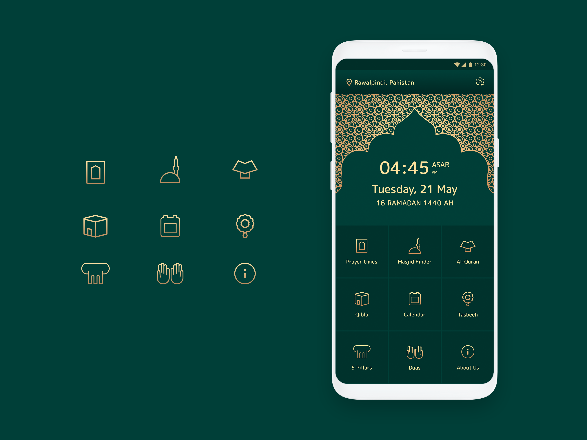
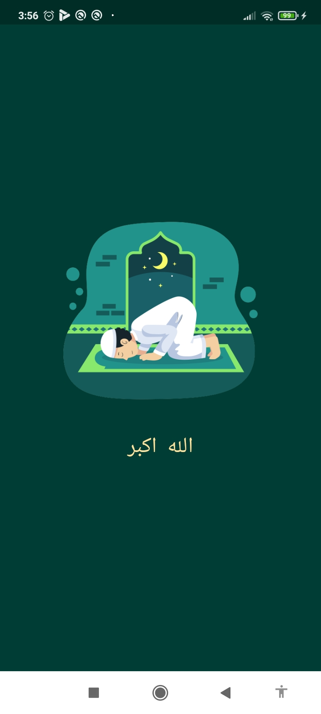
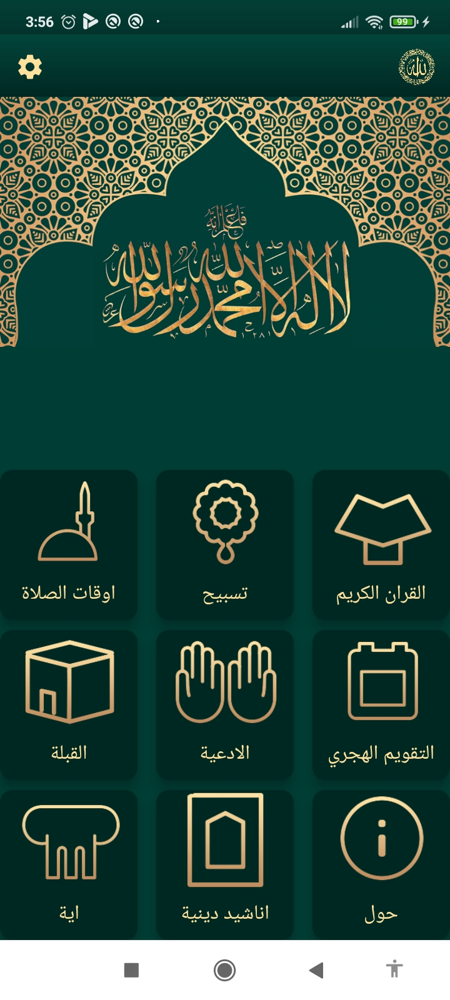
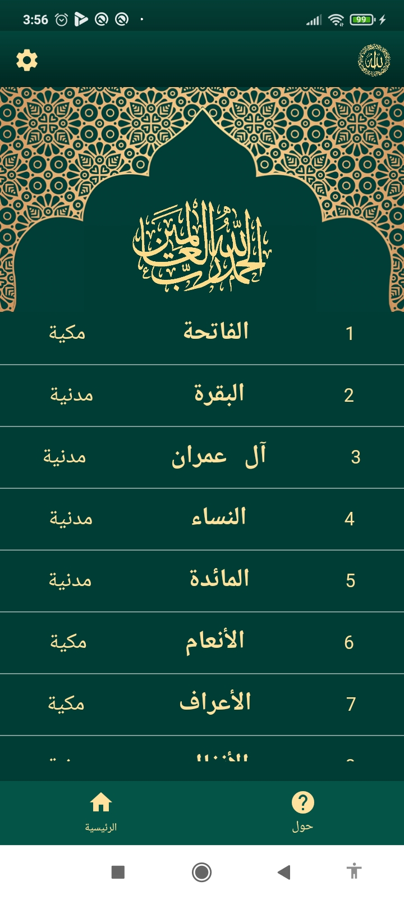
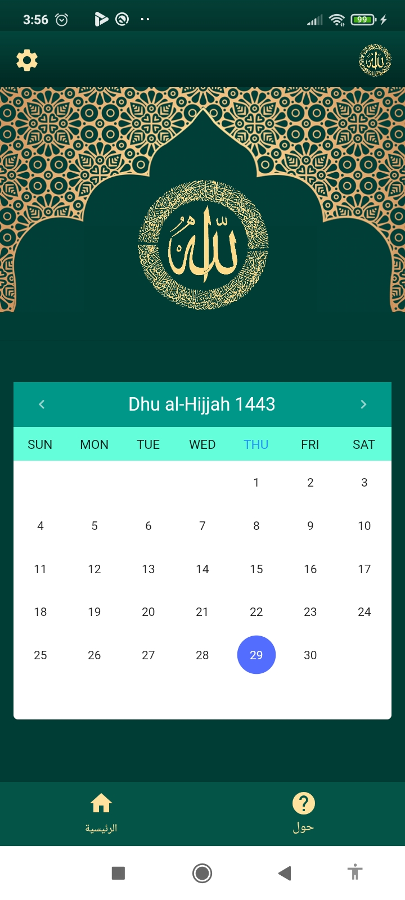
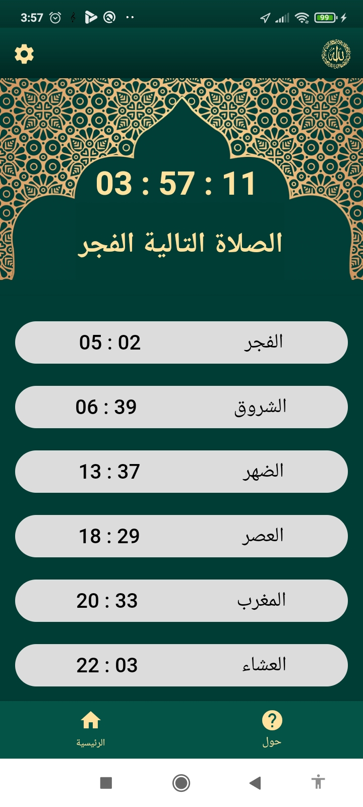
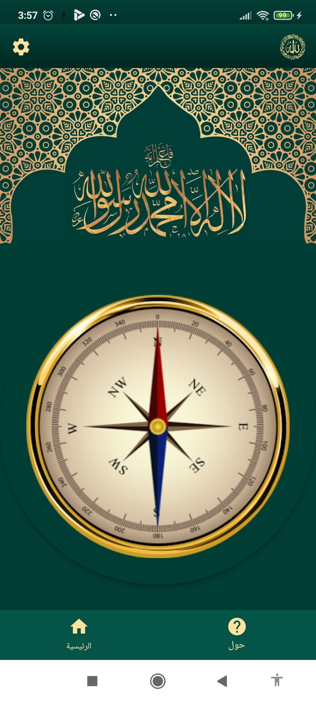
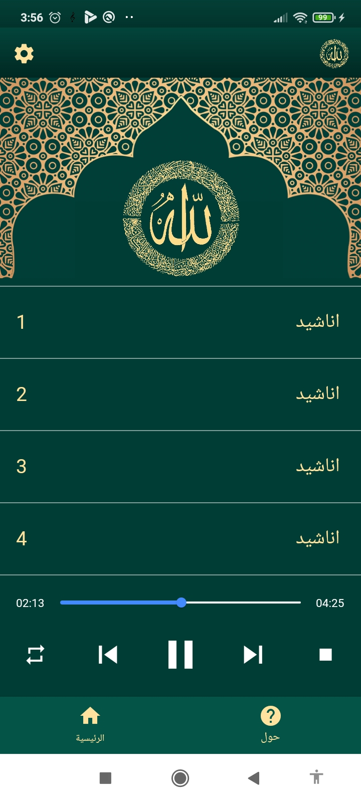
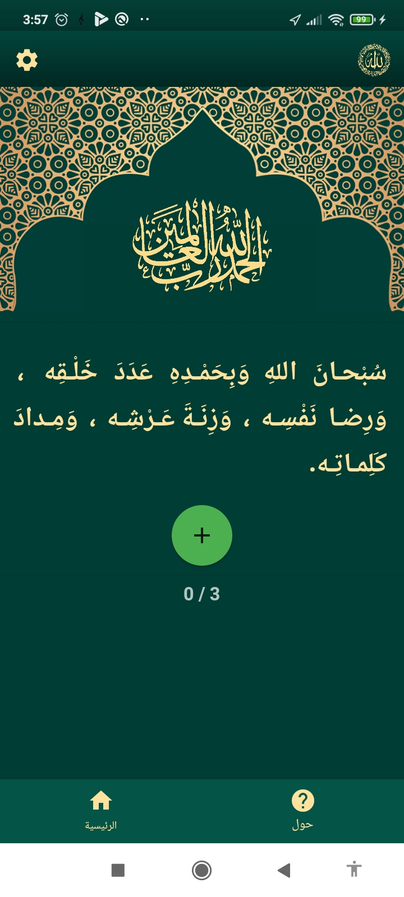
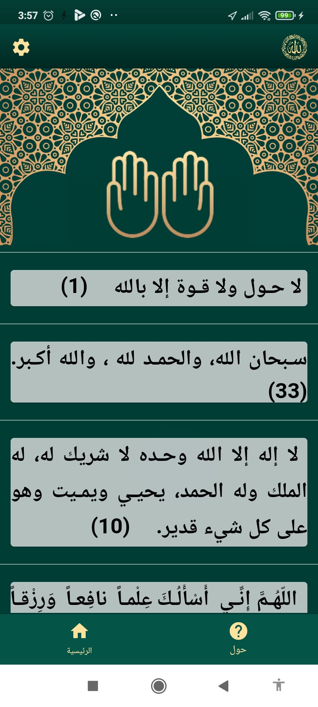

# ayat

## api used https://quran.api-docs.io/v4/
## site help
* gradien  https://generatorhttps://fluttergradientgenerator.com/ 
* change color https://onlinepngtools.com/change-png-color 
* remove bg https://www.remove.bg/fr 